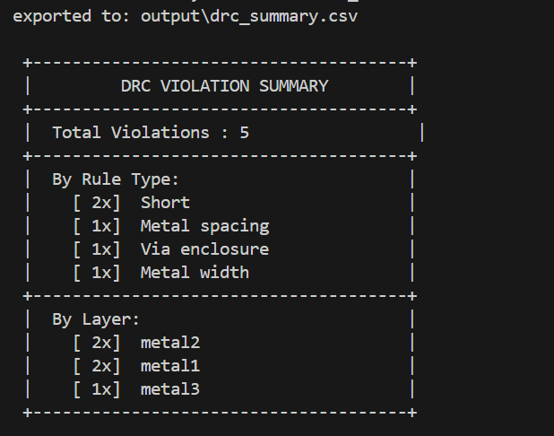
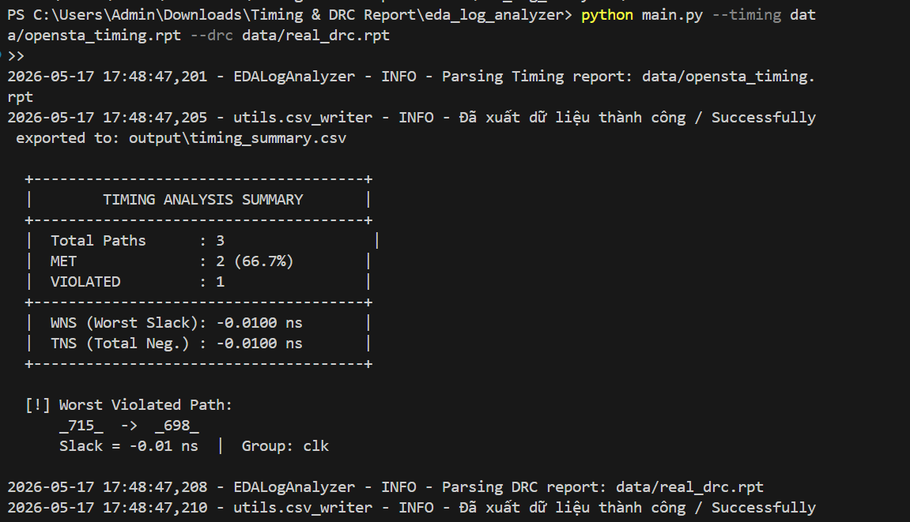
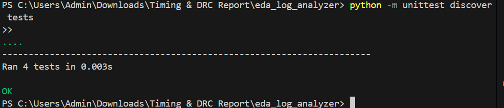
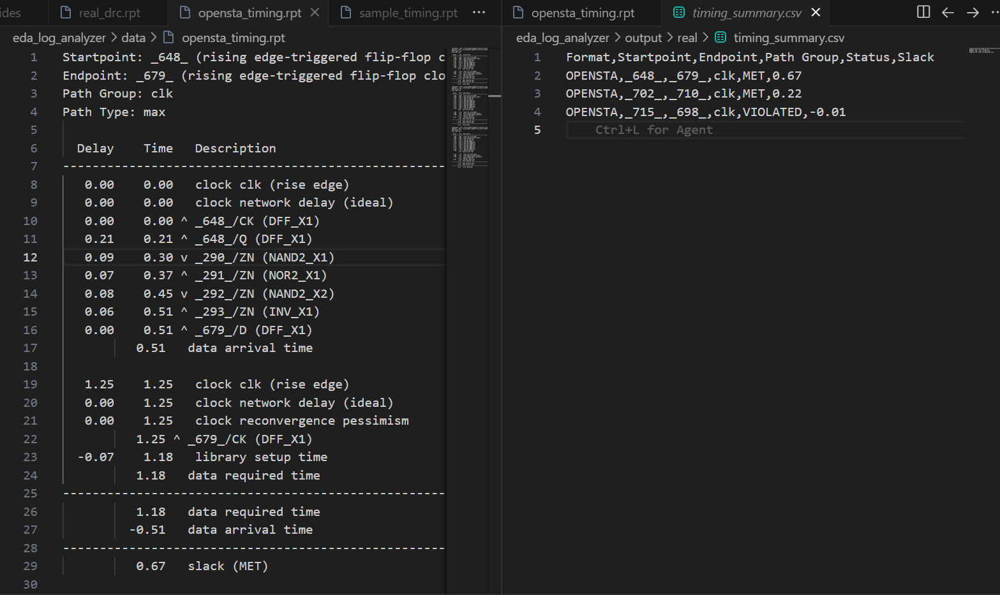
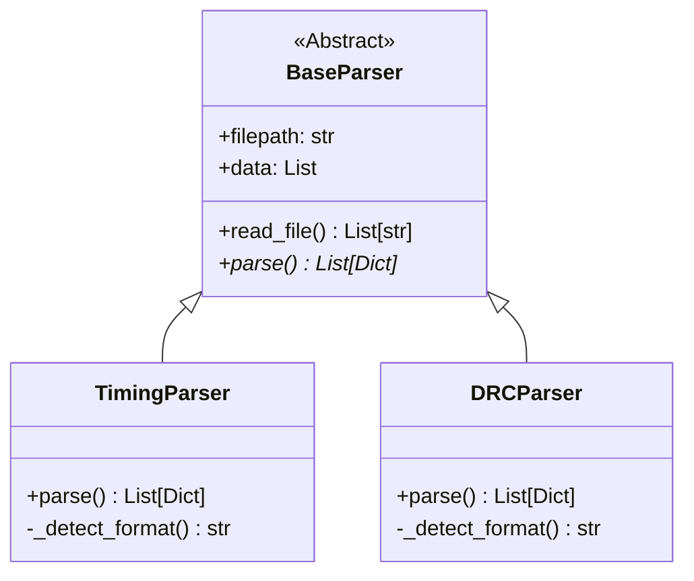

# 🚀 EDA Log Analyzer: Timing & DRC Report Parser

[](https://www.python.org/)
[](https://opensource.org/licenses/MIT)
[-brightgreen.svg?style=for-the-badge&logo=github-actions&logoColor=white)](https://github.com/)
[](https://en.wikipedia.org/wiki/Physical_design_(electronics))

A high-performance, object-oriented Python automation toolkit designed to parse, extract, and analyze raw text-based **Timing (STA)** and **DRC (Design Rule Check)** reports generated by industry-standard EDA tools. This tool automatically digests messy, thousands-of-lines-long ASCII logs and converts them into structured, analysis-ready **CSV files**, while printing real-time, beautifully formatted statistical summary tables directly to the terminal.

This project is built using strictly **Object-Oriented Design Patterns** (Abstract Class pattern conforming to the **Open/Closed Principle**) to demonstrate production-grade software engineering and scripting proficiency for backend **LSI Physical Design / CAD Automation** roles.

---

## 📌 Table of Contents
1. [🎯 Project Overview & Motivation](#-project-overview--motivation)
2. [✨ Key Features](#-key-features)
3. [🐧 Linux EDA Commands (How Logs Are Generated)](#-linux-eda-commands-how-logs-are-generated)
4. [📂 Project Structure](#-project-structure)
5. [⚙️ Installation & Requirements](#️-installation--requirements)
6. [🚀 CLI Usage & Commands](#-cli-usage--commands)
7. [🖥️ Terminal Output & Screenshots](#️-terminal-output--screenshots)
8. [📊 Extracted CSV Formats](#-extracted-csv-formats)
9. [🏗️ Software Architecture & Design Patterns](#️-software-architecture--design-patterns)
10. [🧪 Robust Unit Testing](#-robust-unit-testing)
11. [🔭 Future Roadmaps & Improvements](#-future-roadmaps--improvements)

---

## 🎯 Project Overview & Motivation

In modern **VLSI physical design flows** (Netlist-to-GDSII), Electronic Design Automation (EDA) tools like **Synopsys PrimeTime**, **OpenSTA**, **Cadence Innovus**, and **OpenROAD** generate massive ASCII reports.
* **Timing Reports (`.rpt`)**: Contain Setup/Hold constraints across hundreds of thousands of paths. Manual checking of Worst Negative Slack (WNS) or critical path bottlenecks is impossible at scale.
* **DRC Reports (`.rpt` / `.lyr`)**: List physical design rule violations (e.g., Shorts, Metal Spacing, Enclosures) with complex coordinates and net names.

### The Pain Point
Engineers waste significant time scanning log files to extract violation details, check layer densities, or format data for management reporting.

### The Solution
The **EDA Log Analyzer** automates this parsing instantly. It:
1. Automatically scans the log, detects the specific tool output format, and parses it.
2. Extracts critical spatial and timing metrics.
3. Groups and aggregates statistics (TNS, WNS, violation density per layer/metal).
4. Outputs standardized CSVs for immediate integration with database pipelines, pandas, or Excel.

---

## ✨ Key Features

* 🧠 **Zero-Config Auto-Detection**: Intelligently identifies whether the input is a simplified sample or a production log from **OpenSTA** (for timing) or **OpenROAD TritonRoute** (for DRC) by sniffing file headers.
* ⚡ **Timing Parser Module**: Extracts `Startpoint`, `Endpoint`, `Path Group`, `Status` (MET/VIOLATED), and numeric `Slack` (WNS/TNS).
* 📐 **DRC Parser Module**: Extracts physical coordinates `(X1, Y1) -> (X2, Y2)` (bounding box), target `Layer` name, violated `Rule` type, and affected logical `Sources` (nets/pins).
* 📊 **Terminal Statistics Reporter**: Displays colorful, clean ASCII boxes summarizing WNS, TNS, failure rates, and violation breakdowns by layer and rule.
* 🧩 **Extensible OOP Core**: Designed with strict Python Abstract Base Classes (`abc`) to facilitate easy addition of future parsers (e.g., LVS, Power, EM/IR-Drop) without breaking existing interfaces.
* 🛡️ **Defensive Engineering**: Strictly implements logging hierarchies using Python's native `logging` module and avoids heavy external dependencies like `pandas` or `numpy` to ensure maximum portability across thin-client Unix environments in secure cleanrooms.

---

## 🐧 Linux EDA Commands (How Logs Are Generated)

In a real ASIC backend workflow, these reports are generated on **Linux servers** using EDA tool shells. Below are the actual commands used in the VLSI pipeline to output the files parsed by this toolkit:

### 1. Static Timing Analysis (STA) Reports
Engineers use **OpenSTA** or **Synopsys PrimeTime** on Linux to analyze timing. A typical shell command looks like this:
```bash
# Execute OpenSTA with a custom TCL analysis script
sta -f run_sta.tcl > opensta_execution.log
```
Inside the `run_sta.tcl` script, the reporting command that produces the `opensta_timing.rpt` format is:
```tcl
# Read design library, netlist, and design constraints (SDC)
read_liberty cells.lib
read_verilog synth_design.v
link_design top_module
read_sdc constraints.sdc

# Generate the detailed timing check report parsed by our tool
report_checks -path_delay max -format full -fields {input_pin transition role} > data/opensta_timing.rpt
```

### 2. Design Rule Check (DRC) Reports
Physical verification is executed via **OpenROAD TritonRoute** or **Siemens Calibre** during detail routing. The Linux CLI command is:
```bash
# Execute detail routing and export physical violations
openroad -no_init -exit run_route.tcl > routing_execution.log
```
The TCL routing script command that outputs the `real_drc.rpt` file parsed by our tool is:
```tcl
# Run detailed routing and define the DRC output report path
detailed_route -output_drc data/real_drc.rpt
```

---

## 📂 Project Structure

The project layout follows professional Python scripting conventions with decoupled directories:

```text
eda_log_analyzer/
│
├── parsers/                  # Parsing Core (OOP Domain)
│   ├── __init__.py
│   ├── base_parser.py        # Abstract base class (defines the standard API)
│   ├── timing_parser.py      # Timing Report parser (Simple & OpenSTA formats)
│   └── drc_parser.py         # DRC Report parser (Simple & OpenROAD formats)
│
├── utils/                    # Common Utility Libraries
│   ├── __init__.py
│   ├── csv_writer.py         # Thread-safe/exception-resistant CSV exporter
│   └── reporter.py           # Console ASCII formatter for statistics
│
├── tests/                    # Robust Unit Test Suite (Mocking framework)
│   ├── __init__.py
│   ├── test_timing_parser.py # Unit tests for Timing formats (Simple & OpenSTA)
│   └── test_drc_parser.py    # Unit tests for DRC formats (Simple & OpenROAD)
│
├── data/                     # Input Test Reports (Realistic & Simplified)
│   ├── sample_timing.rpt     # Simple timing report (mock)
│   ├── opensta_timing.rpt    # Real OpenSTA timing report 
│   ├── sample_drc.rpt        # Simple DRC report (mock)
│   └── real_drc.rpt          # Real OpenROAD TritonRoute DRC report
│
├── output/                   # Auto-generated structured results
│   ├── timing_summary.csv    # Extracted Timing CSV
│   └── drc_summary.csv       # Extracted DRC CSV
│
├── screenshots/              # Portfolio screenshots directory
│   └── .gitkeep              # Git directory tracking placeholder
│
├── main.py                   # CLI Application Entry point
└── README.md                 # Technical Documentation
```

---

## ⚙️ Installation & Requirements

### System Requirements
* **OS**: Linux (RHEL, Ubuntu), macOS, or Windows
* **Python Version**: Python 3.6 or higher (highly optimized for standard production environments)
* **Dependencies**: **None**. Built using pure Python standard libraries (`re`, `csv`, `argparse`, `logging`, `abc`, `os`, `unittest`) to ensure zero-installation friction on isolated air-gapped secure servers.

### Installation
Clone this repository directly to your workspace:
```bash
git clone https://github.com/yourusername/eda_log_analyzer.git
cd eda_log_analyzer
```

---

## 🚀 CLI Usage & Commands

All operations are executed via `main.py` using standard argument structures:

### 1. Show Help Menu
To inspect arguments and formats:
```bash
python main.py --help
```

### 2. Parse Timing Report Only
```bash
python main.py --timing data/opensta_timing.rpt
```

### 3. Parse DRC Report Only
```bash
python main.py --drc data/real_drc.rpt
```

### 4. Parse Both Reports Simultaneously
```bash
python main.py --timing data/opensta_timing.rpt --drc data/real_drc.rpt
```

### 5. Parse and Export to a Custom Directory
```bash
python main.py --timing data/opensta_timing.rpt --outdir /path/to/custom_output/
```

---

## 🖥️ Terminal Output & Screenshots

When executed, the tool outputs real-time logs and yields high-fidelity ASCII summary tables that display analytical statistics about physical designs:

```text
2026-05-17 17:50:02 - EDALogAnalyzer - INFO - Parsing Timing report: data/opensta_timing.rpt
2026-05-17 17:50:02 - utils.csv_writer - INFO - Successfully exported to: output/timing_summary.csv
2026-05-17 17:50:02 - EDALogAnalyzer - INFO - Parsing DRC report: data/real_drc.rpt
2026-05-17 17:50:02 - utils.csv_writer - INFO - Successfully exported to: output/drc_summary.csv

  +--------------------------------------+
  |        TIMING ANALYSIS SUMMARY       |
  +--------------------------------------+
  |  Total Paths      : 3                |
  |  MET              : 2 (66.7%)        |
  |  VIOLATED         : 1                |
  +--------------------------------------+
  |  WNS (Worst Slack): -0.0100 ns       |
  |  TNS (Total Neg.) : -0.0100 ns       |
  +--------------------------------------+

  [!] Worst Violated Path:
      _715_  ->  _698_
      Slack = -0.01 ns  |  Group: clk

  +--------------------------------------+
  |         DRC VIOLATION SUMMARY        |
  +--------------------------------------+
  |  Total Violations : 5                |
  +--------------------------------------+
  |  By Rule Type:                       |
  |    [ 2x]  Short                      |
  |    [ 1x]  Metal spacing              |
  |    [ 1x]  Via enclosure              |
  |    [ 1x]  Metal width                |
  +--------------------------------------+
  |  By Layer:                           |
  |    [ 2x]  metal2                     |
  |    [ 2x]  metal1                     |
  |    [ 1x]  metal3                     |
  +--------------------------------------+
```

---

### 📸 Project Portfolio Screenshots

#### 1. DRC Violation Analytics (Terminal Output)
The tool displays structured ASCII tables on the terminal summarizing total DRC violations grouped and sorted by rule types and physical metal/via layers.



#### 2. Timing Analysis Statistics (Terminal Output)
The tool outputs real-time statistical breakdowns of Worst Negative Slack (WNS), Total Negative Slack (TNS), path success rates, and details of the worst failing setup/hold paths.



#### 3. Rigorous Test Coverage
Every parser format and edge-case is backed by mock-based unit tests to ensure high software reliability:



#### 4. Complete VS Code Workspace & OOP Architecture
A professional development environment showcasing both the modular directory structure on the left explorer and the split-screen comparison showing raw report logs mapped to clean CSV schemas on the right.



---

## 📊 Extracted CSV Formats

Data is parsed into clean, tabular schemas to allow direct loading into analytical tools.

### 1. `timing_summary.csv`
Contains the status of timing arcs along with physical setup/hold values.
| Format | Startpoint | Endpoint | Path Group | Status | Slack |
| :--- | :--- | :--- | :--- | :--- | :--- |
| **OPENSTA** | `_648_` | `_679_` | `clk` | `MET` | `0.67` |
| **OPENSTA** | `_715_` | `_698_` | `clk` | `VIOLATED` | `-0.01` |

### 2. `drc_summary.csv`
Contains the structural layer, physical coordinate boundaries, and routing nets.
| Format | Rule | Layer | X1 | Y1 | X2 | Y2 | Sources |
| :--- | :--- | :--- | :--- | :--- | :--- | :--- | :--- |
| **OpenROAD** | `Short` | `metal2` | `48.29` | `12.54` | `48.43` | `12.96` | `net36 net22` |
| **OpenROAD** | `Metal spacing` | `metal1` | `10.26` | `5.32` | `10.40` | `5.60` | `_367_/ZN _368_/A` |

---

## 🏗️ Software Architecture & Design Patterns

To make the codebase robust and clean, the tool strictly adheres to standard software engineering designs:

### 1. Unified Interface via ABC (Open/Closed Principle)
All parsers inherit from `BaseParser`, which acts as an interface:


This guarantees that if the user wants to add an **LVS (Layout vs Schematic)** or an **IR-Drop** parser, they only need to create a new class sub-classing `BaseParser` and write their regex logic inside the `parse()` method. The `main.py` flow will call it seamlessly.

### 2. Regex Buffering & Performance
Instead of loading entire gigabyte-scale logs into memory, the parsers scan line-by-line using pre-compiled regular expressions (`re.compile`), maximizing text processing efficiency.

---

## 🧪 Robust Unit Testing

Unit testing is vital for automated tools in mission-critical tape-out pipelines. 

### Core Testing Strategy
* **Mocking File I/O**: Tests use `unittest.mock.patch` to mock `read_file` results. This ensures that tests do not read the disk, keeping execution times under milliseconds.
* **Format-Specific Coverage**: The tests verify the accuracy of parsing logic across all supported formats (Simple, OpenSTA, and OpenROAD TritonRoute).

### Run Test Suite
```bash
python -m unittest discover tests
```
**Test Results:**
```text
....
----------------------------------------------------------------------
Ran 4 tests in 0.004s

OK
```

---

## 🔭 Future Roadmaps & Improvements

To take this automation tool to the production scale, the following extensions are planned:

1. **🎨 Die-Canvas Violation Heatmaps**: Integrate `matplotlib` and `seaborn` to draw 2D spatial density maps of DRC violations over physical cell grids using `(X1, Y1, X2, Y2)` coordinates.
2. **📈 Slack Distribution Histograms**: Graphically display WNS distributions to analyze design margin bottlenecks before physical optimization.
3. **⚡ Multithreading Support**: Execute the parsing logic of multiple Timing/DRC logs in parallel utilizing Python's `multiprocessing` to parse gigabytes of design log files within seconds.
4. **🔗 Pipeline Ingestion**: Add JSON or REST API export features to easily ingest metrics into enterprise database monitoring tools like Grafana or Elasticsearch.
---
